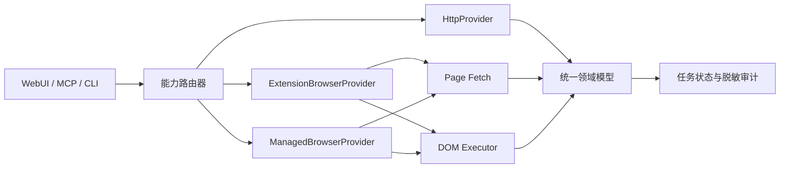

# 普通用户自动化访问模式设计讨论

> 状态：持续更新。本文同时记录设计共识、当前实现和真实验收边界；“已实现”不等于
> 已在所有账号与平台风控条件下真实通过。

## 目标

面向不具备企业开放平台资质的普通用户，在用户主动登录和授权的前提下，
为读取、下载、互动与发布提供可选择、可审计的自动化方式。

设计目标：

- 同时支持 Cookie + HTTP、浏览器扩展和 CDP/Playwright 受管浏览器三条路径。
- 让不希望安装扩展的普通用户可以使用专用浏览器完成登录和自动化。
- 调用方只依赖统一能力模型，不感知页面解析、页面请求或 DOM 操作细节。
- 只读能力允许受控回退；外部写操作禁止产生重复副作用。
- 不读取、上传或记录用户浏览器 Cookie、敏感请求头和原始页面内容。

非目标：

- 不把企业开放平台作为普通用户的必备条件。
- 不绕过验证码、身份验证、平台风险控制或账号权限。
- 不承诺所有能力在 HTTP、扩展和受管浏览器中都有相同实现。
- 不通过伪造设备环境、批量账号或高频请求规避平台限制。

## 当前状态

| 能力路径 | 当前已有能力 | 当前边界 |
| --- | --- | --- |
| Cookie + HTTP | 短链接解析、作品详情、初始状态解析、媒体下载；统一读取 Provider 已支持推荐、默认筛选搜索、详情、指定主页及严格身份确认后的当前主页 | Cookie 必须由用户显式配置；非默认搜索筛选返回 `unsupported`；账号证明只在 Provider 内生成一次性 HMAC；不承担互动和发布；当前保存值已过期，成功读取路径待更新后复验 |
| 浏览器扩展 | 扫码登录、推荐、搜索、详情、评论、主页、互动、发布、站点 Cookie 清理 | 已接入统一路由；协议 5 通过独立内存通道和页面 WebCrypto 生成账号证明，不写浏览器任务或存储；评论仍受平台安全验证限制 |
| 受管浏览器 | 专用 Chromium、独立 Profile、登录、推荐、搜索、详情、主页、点赞、收藏、私密图文/视频及平台定时发布 | 账号证明通过同一控制器、独占闸门和 CDP 会话在页面内计算；登录持久化、异常恢复、真实读取及点赞/收藏切换后恢复均已通过；私密发布仍待该 Profile 现场验收 |

Cookie 当前由本地服务的 `XHS_COOKIE` 配置管理，只允许覆盖或清除，
API 和 WebUI 不返回原文。扩展使用浏览器已有登录态，不申请 Cookie 读取权限；
它只通过 `browsingData` 按小红书来源清理站点 Cookie。

早期真实验收曾确认扩展会话与 Cookie HTTP 会话属于同一账号；当前 HTTP Cookie
已经清除，受管 Profile 又是独立会话，不能沿用该结论。Cookie 可以让 HTTP 页面
返回登录身份，但不能替代帖子链接携带的 `xsec_token` 等访问上下文；私密帖子
去掉该上下文后仍可能没有可解析的作品数据。

登录与会话管理已经形成统一入口：二维码来自真实登录页，API 响应后会从持久化
任务结果中擦除图片；清理接口要求显式确认，并通过 `target=browser|http`
区分浏览器会话与 Cookie HTTP 会话。Cookie、代理、超时、重试、User-Agent、
路由策略和浏览器驱动会先等待当前请求结束，再原子替换运行时；清除 HTTP Cookie
后新请求立即切换到匿名状态，无需重启。

## 可用的自动化方法

### Cookie + HTTP

本地服务携带用户配置的 Cookie 请求网页或具备稳定契约的接口。

优势：

- 延迟低、资源占用小，适合并发读取和媒体下载。
- 易于做超时、重试、缓存、内容指纹和文件校验。

局限：

- Cookie 与浏览器登录态相互独立，可能属于不同账号。
- 部分页面能力依赖动态请求上下文，不能假设仅添加 Cookie 即可使用。
- 站内接口变化时需要独立维护请求和结果适配器。

HTTP 首期只承担读取和下载，不承担互动与发布。

### 浏览器扩展 DOM 与可信输入

内容脚本负责解析 DOM 和页面状态；需要写入时，由后台在当前已授权任务和标签页
范围内使用 `chrome.debugger` 发送可信鼠标或键盘输入。普通内容脚本派发的合成
事件仍只能作为兼容手段，不能只凭页面内状态变化判定写操作成功。

适合：

- 登录状态、推荐、搜索、详情、评论和主页读取。
- 下载协作、站点 Cookie 清理和页面兼容性诊断。
- 在用户明确选择后执行互动与发布，并通过新页面或平台结果回读持久化状态。

DOM 操作必须采用语义锚点、目标状态核验、有界滚动和兼容性诊断；
不能用固定等待时间代替完成状态判断。

2026-07-25 的真实验收进一步确认：

- 点赞和取消点赞已使用受控可信鼠标输入，并在两个独立页面任务间保持目标状态。
- 收藏与取消收藏已通过受控可信鼠标输入执行；启用和取消后均由全新页面回读到
  目标状态，验收结束时恢复为未收藏。
- 评论的输入、按钮启用和点击均可执行，但平台会弹出扫码验证；验证未完成或任务
  页面被关闭时，评论不会发布。
- 即使通过真实浏览器键盘和鼠标输入，当前账号仍会触发同一安全验证，因此不能把
  风控误判为扩展选择器缺陷，也不能尝试绕过。
- 图文发布可以完成素材上传、文案、标签和仅自己可见设置；当前扩展已使用
  `chrome.debugger` 发送可信回车，但新版封闭影子根中的发布按钮没有被触发，
  用户在同一页面真实鼠标点击后平台明确返回发布成功。执行器已改为通过桥接层
  取得按钮中心坐标并发送 CDP 鼠标移动、按下和释放；随后 5 秒合成视频的真实
  发布任务由 `publishing` 直接进入 `published`。图片页进一步发现聚焦会滚动
  页面并使旧坐标失效。布局稳定、二次测量与完整鼠标状态仍未触发图片页提交，
  而同一按钮经浏览器原生可访问性点击立即成功。因此扩展保留 CDP 鼠标为首选，
  一秒后仅在页面仍停留且按钮仍可用时调用封闭影子根内的真实按钮作为防重复兜底。
  重载后的私密定时图文已全程无人工操作并由平台确认发布成功。
- 后台发布闹钟已确认每 30 秒正常触发。立即发布的 `manual` 任务由带
  `xhd_task` 参数的创作页明确领取；只有 `scheduled` 本地定时任务会由后台
  主动领取并打开创作页，不能用前者判断闹钟是否失效。
- `platform_scheduled` 必须在提交后立即由带 `xhd_task` 的创作页领取，并把
  绝对时间按 `Asia/Shanghai` 写入平台定时控件。真实私密图文回读到
  `post_timing=true` 和非零 `schedule_post_time`，证明任务已交给平台排期，
  而不是误走立即发布。

### 页面上下文请求

在已登录页面的主世界中执行同源请求或读取页面已经取得的结构化响应，
复用浏览器会话完成只读操作。

它不是对用户暴露的新模式，而是浏览器 Provider 内部的执行器：

```text
Browser Provider
├── Page Fetch：结构化只读请求
├── DOM：页面读取与交互
└── Vision：最后兜底
```

推荐、搜索、详情和主页可以优先尝试 Page Fetch，明确不支持时再退回 DOM。
页面请求不得把 Cookie、令牌、完整请求头或原始响应上传到本地服务。

### CDP/Playwright 受管浏览器

本地服务启动专用 Chromium，或连接使用专用用户数据目录启动的浏览器。
用户首次扫码登录，之后通过持久化浏览器目录保留会话。

适合：

- 不希望安装扩展的用户。
- Docker、NAS、远程主机和定时任务。
- 多账号隔离和无人值守任务。
- 需要统一截图、网络状态和页面诊断的场景。

安全边界：

- 每个账号使用独立且权限受限的用户数据目录。
- 不连接用户日常使用的默认 Chrome 配置。
- CDP 端口只监听本机，不对局域网或公网开放。
- 同一浏览器目录只能由一个运行实例持有。
- 浏览器启动、退出和异常恢复必须由明确的生命周期组件管理。

互动和发布还要求：

- 使用 CDP 鼠标、键盘和文件输入事件，不以 `HTMLElement.click()` 或手工派发
  `InputEvent` 作为正式写入执行器。
- 遇到扫码验证、验证码或身份确认时暂停任务并保留原标签页，不关闭、不刷新、
  不自动重试。
- 用户完成验证后恢复同一个任务和页面上下文，再执行一次明确的后续动作。
- 恢复前后都执行持久化回读；无法确认时进入 `needs_review`。

Chrome 136 起，默认用户数据目录不再接受远程调试参数，因此受管浏览器必须
使用专用 `user-data-dir`。

当前实现已经完成以下基础边界：

- Chromium 使用应用状态目录下的专用持久化 Profile，启动参数不接触日常
  Chrome 配置。
- CDP 由 Chromium 随机分配端口并只监听 `127.0.0.1`，用户目录由操作系统
  文件锁保证单实例。
- Playwright 只连接已有 Chromium；每项任务结束后断开自动化会话，不越权
  终止浏览器进程。
- 扩展源码构建出共享页面适配器，扩展和受管浏览器复用登录、推荐、搜索、
  详情、主页解析与脱敏语义锚点。
- SQLite 任务在提交时冻结 `extension` 或 `managed`，两个执行器不能交叉领取。
- 受管发布 Worker 已接入共享 Chromium、独占执行闸门和 API 生命周期，支持私密
  图文、视频及平台定时发布；发布结果不确定时进入 `needs_review`。
- 受管发布任务遇到安全验证时保留原页面并进入 `awaiting_verification`；用户明确确认
  后只能恢复同一任务和页面，发布点击不会重复执行。
- WebUI 会按任务冻结的驱动显示扩展或受管浏览器；受管模式不会额外打开日常浏览器
  创作页，并在提交前固定为私密、无商品的首批安全边界。
- 页面失败记录会显示实际执行驱动，并只允许展示和复制适配器版本、页面类型与已知
  语义锚点；URL、令牌、原始页面和用户文本不进入界面。

普通业务接口已接入下面定义的四种统一路由策略。每次成功读取都会返回实际
Provider、尝试顺序和结构化回退原因；只有尝试过浏览器 Provider 时才返回本次
冻结的浏览器驱动。同一请求始终租用固定配置快照，不会在运行中混用更新前后的
Cookie 或驱动。

当前真实验收边界：

- 扩展的推荐、搜索、详情、指定主页和当前账号主页均通过统一接口。
- HTTP 统一读取 Provider 的推荐、默认筛选搜索、详情、指定主页和严格身份确认后的
  当前主页均有自动化契约覆盖；非默认搜索筛选会在发出请求前返回
  `unsupported`。
- 五项读取 Schema 都包含点赞、收藏等账号态字段，因此发生非登录类安全失败并准备
  跨 Provider 回退时，必须先通过一次性账号一致性门禁。只有 `matched` 才会调用
  第二 Provider；明确未配置或认证已过期时没有可比较的首选会话，可按原规则回退。
- 未配置 Cookie 时，`http_only` 会结构化返回 `not_configured`；当前已过期 Cookie
  已真实返回 `authentication_expired`，并由 `http_first` 安全回退到协议 5 扩展。
  更新 Cookie 后的统一读取成功路径仍需重新验收。
- 受管浏览器的独立 Profile 已在重启后恢复登录；推荐、普通搜索、详情和当前主页
  均真实返回，页面内一次性账号证明为 `proved`。专用进程被强制终止后能准确
  报告异常，并以新回环 CDP 端口恢复。
- 受管点赞、收藏已完成预检、Playwright 可信点击和严格回读；登录 Profile 中
  两项均真实切换成功并恢复原状态。点击后的任何不确定性仍会进入
  `needs_review`，不会跨驱动重试。
- 受管私密图文、视频、平台定时发布及安全验证恢复已接入生产 Worker，并覆盖
  启动回滚、页面聚焦、暂停恢复和防重复发布测试；真实发布必须由用户在最终提交前
  再次确认。

### 手机 App 自动化

Android 可使用 Appium + UiAutomator2/ADB，iOS 可使用 Appium +
XCUITest/WebDriverAgent。

它能覆盖网页端不存在的能力，但需要真机、调试环境和长期维护，且设备并发能力弱。
只有确认存在必须支持的 App 独占能力时，才考虑加入后续阶段。

### 视觉与桌面 RPA

通过截图、OCR、可访问性树或坐标操作处理 DOM 无法访问的控件。

视觉执行器只能作为最后兜底：

- 每次动作后仍需结构化核验。
- 识别置信度不足时暂停并让用户接管。
- 不自动处理验证码、风险提示和身份确认。

用户脚本、书签脚本和桌面宏属于交付或控制方式，不应成为新的领域 Provider。

## 推荐架构



三个正式 Provider：

- `HttpProvider`
- `ExtensionBrowserProvider`
- `ManagedBrowserProvider`

扩展与受管浏览器复用相同的页面适配器、结果 Schema、任务状态机和兼容性诊断，
只替换浏览器控制与通信方式。

`xiaohongshu-mcp` 在 2026-07-20 引入的交互实现可以作为受管浏览器输入层参考：
它通过 Rod/CDP 移动鼠标、点击并逐字输入，比内容脚本事件更接近真实输入；但其
评论实现只在提交后等待四秒查找文本，没有扫码验证后的暂停与恢复，所以不能直接
复制为完整方案。

## 路由策略

当前配置使用一项全局只读路由策略：

- `http_only`：只使用 HTTP，失败即返回。
- `browser_only`：只使用当前浏览器驱动。
- `http_first`：HTTP 明确失败后尝试浏览器。
- `browser_first`：浏览器明确不可用后尝试 HTTP。

写操作不使用上述回退顺序。点赞、收藏、评论、回复和发布在任务提交时冻结用户所选
`browser_driver`，执行后不能自动切换扩展或受管浏览器。

正式配置只有两个字段：

```dotenv
XHS_ROUTE_STRATEGY=browser_only
XHS_BROWSER_DRIVER=extension
```

默认值为 `browser_only + extension`。WebUI 可把驱动切换为 `managed`，也可选择
四种全局路由策略；修改会等待在途请求结束后原子替换运行时。按作品详情、搜索等
能力分别覆盖路由仍属于未来设计，不是当前接口。

## 回退规则

只读任务满足以下条件时可以自动回退：

- 当前 Provider 离线或未配置。
- 认证已明确失效。
- Provider 明确声明不支持该能力。
- 页面或协议适配器返回可识别的兼容性错误。
- 首选 Provider 尚未产生外部副作用。

以下情况不能作为回退依据：

- 返回空列表或零条评论，因为空结果可能真实有效。
- 响应较慢但仍在允许超时内。
- 结果与调用方预期不同，但通过了正式 Schema。

点赞、收藏、评论、回复和发布一旦开始执行，禁止自动切换 Provider。
超时或断线导致结果不确定时必须进入 `needs_review`，由用户确认后才能继续。

## 账号与会话一致性

三条路径最多同时存在三套相互独立的会话：

- HTTP Cookie 对应的账号。
- 浏览器扩展当前登录账号。
- 受管浏览器专用 Profile 当前登录账号。

账号相关的自动回退不会把稳定用户 ID 或昵称写入路由审计。当前门禁每次生成新的
256 位随机密钥和随机挑战标识，HTTP 与当前浏览器分别计算 HMAC-SHA-256；核心层
只做恒定时间摘要比较，对外仅返回 `matched`、`different`、`logged_out` 或
`unverified`。

当前实现边界：

- 现有推荐、搜索、详情、指定主页和当前主页结果都携带账号互动状态，因此全部按
  `account_scoped` 处理；以后只有新增剥离账号态字段的公开 Schema 才能免门禁。
- 只有 `matched` 允许继续回退；`different`、`logged_out` 和 `unverified`
  固定返回脱敏冲突并停止。
- HTTP Provider 内部从当前页面取得账号标识并直接生成 HMAC，不把标识返回运行时。
- 扩展协议 5 使用独立的挑战 Claim/Answer API、Bearer 认证和一次性租约；内容脚本
  在隔离世界读取实时状态并使用 WebCrypto，只回传 HMAC 或稳定状态。挑战不复用
  `BrowserTask`，不进入 SQLite、`chrome.storage`、失败诊断或日志。
- 受管浏览器使用当前进程持有的同一 Profile、CDP 会话和独占执行闸门；不会自动
  启动浏览器，也不会借用扩展会话证明受管 Profile。
- 首期只允许唯一在线扩展参加证明；零个、多个或旧协议扩展均收敛为
  `unverified`。多 Profile 精确绑定属于后续能力。
- 任务和审计记录只保存 Provider、浏览器驱动和挑战结论，不得保存 Cookie、账号
  标识或可跨任务关联的稳定指纹。

领域门禁、HTTP、扩展、受管 CDP、API、MCP 和 WebUI 已完成自动化契约与构建验证；
协议 5 挑战通道与页面水合后的 DOM 账号识别兜底均已真实重载，扩展真实登录页
满足严格同源主页证明条件，受管真实页面已返回 `proved`。当前 HTTP Cookie 已
过期，刷新 Cookie 后的 `matched/different` 现场矩阵仍需复验。

## 可观测性

当前任务与统一读取结果已经提供以下可观测字段：

- 实际 Provider；尝试过浏览器时还包含冻结的浏览器驱动。
- 是否发生回退、结构化原因和 Provider 尝试顺序。
- 受保护回退成功时包含一次性的 `account_consistency=matched`；被阻止时只返回
  固定结论和安全文案。
- 任务领取次数、更新时间和结果核验状态。
- 失败任务中经过白名单过滤的页面适配器版本和语义锚点。

不得记录 Cookie、访问令牌、完整 URL 查询参数、请求正文、用户原文或未脱敏截图。

“自动选择”初期只根据配置、在线状态和结构化错误工作，不根据历史数据进行
不透明的自学习切换。当前尚未提供独立的执行耗时字段；补充稳定指标后，再讨论
熔断与动态路由。

## 实施状态

1. 已完成统一能力结果与失败类型、路由器和路由元数据；可替换 Provider Protocol
   与能力注册表尚未形成正式接口。
2. 已完成 HTTP 统一读取 Provider、扩展任务和受管浏览器任务的路由接入。
3. 已复用浏览器共享页面适配器；Page Fetch 仍作为浏览器 Provider 内部的可选优化，
   不改变对外能力契约。
4. 已完成专用用户目录、回环 CDP、单实例锁、生命周期、可信输入和异常恢复；
   登录后真实写操作待现场验收。
5. 已完成受管发布安全验证的页面保留、用户接管和同任务恢复；真实风控触发路径待
   现场验收。
6. 已实现 HTTP 推荐、默认筛选搜索、详情、指定主页和严格身份确认后的当前主页，
   HTTP 继续限定为只读。
7. 已实现混合路由的脱敏账号一致性门禁；协议 5 扩展挑战通道和过期 Cookie 安全
   回退已真实通过，三种有效登录会话的现场矩阵待复验。
8. 只有出现明确的 App 独占需求时，再评估手机自动化。

## 当前产品决策与后续事项

- 首期已经支持本机桌面的可见受管 Chromium；Docker 与无头环境尚未真实验收。
- 首期每个应用状态目录使用一个受管 Profile；多账号隔离留作后续能力。
- HTTP Provider 固定为只读，不预留自动写操作。
- 当前默认是 `browser_only + extension`，用户可在 WebUI 选择受管浏览器或混合
  路由；是否在未来把混合策略设为默认仍需依据真实成功率决定。

## 参考资料

- [Chrome 扩展内容脚本](https://developer.chrome.com/docs/extensions/develop/concepts/content-scripts)
- [Chrome Debugger API](https://developer.chrome.com/docs/extensions/reference/api/debugger)
- [Chrome DevTools Protocol](https://chromedevtools.github.io/devtools-protocol/)
- [Playwright `connectOverCDP`](https://playwright.dev/docs/api/class-browsertype)
- [Chrome 远程调试安全变更](https://developer.chrome.com/blog/remote-debugging-port)
- [Appium 驱动架构](https://appium.io/docs/en/latest/intro/drivers/)
