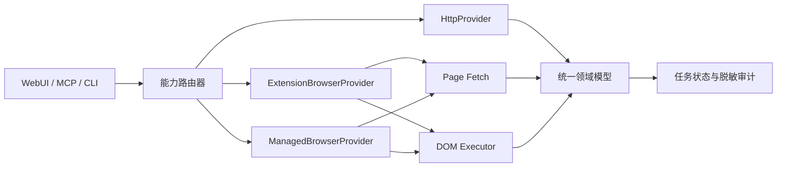

# 普通用户自动化访问模式设计讨论

> 状态：讨论稿。本文记录当前设计共识，不代表相关能力均已实现。

## 目标

面向不具备企业开放平台资质的普通用户，在用户主动登录和授权的前提下，
为读取、下载、互动与发布提供可选择、可审计的自动化方式。

设计目标：

- 同时保留 Cookie + HTTP 与浏览器扩展两条现有路径。
- 增加可选的 CDP/Playwright 受管浏览器，满足无扩展和无人值守场景。
- 调用方只依赖统一能力模型，不感知页面解析、页面请求或 DOM 操作细节。
- 只读能力允许受控回退；外部写操作禁止产生重复副作用。
- 不读取、上传或记录用户浏览器 Cookie、敏感请求头和原始页面内容。

非目标：

- 不把企业开放平台作为普通用户的必备条件。
- 不绕过验证码、身份验证、平台风险控制或账号权限。
- 不承诺所有能力在 HTTP、扩展和受管浏览器中都有相同实现。
- 不通过伪造设备环境、批量账号或高频请求规避平台限制。

## 当前状态

| 能力路径 | 当前已有能力 | 当前边界 |
| --- | --- | --- |
| Cookie + HTTP | 短链接解析、作品页面请求、初始状态解析、媒体下载 | 尚未覆盖推荐、搜索、主页、互动和发布 |
| 浏览器扩展 | 扫码登录、推荐、搜索、详情、评论、主页、互动、发布、站点 Cookie 清理 | 依赖用户安装扩展以及页面结构兼容 |
| 受管浏览器 | 尚未实现 | 需要独立浏览器目录、生命周期和本机控制协议 |

Cookie 当前由本地服务的 `XHS_COOKIE` 配置管理，只允许覆盖或清除，
API 和 WebUI 不返回原文。扩展使用浏览器已有登录态，不申请 Cookie 读取权限；
它只通过 `browsingData` 按小红书来源清理站点 Cookie。

登录与会话管理已经形成统一入口：二维码来自真实登录页，API 响应后会从持久化
任务结果中擦除图片；清理接口要求显式确认，并通过 `target=browser|http`
区分浏览器会话与 Cookie HTTP 会话。清除 HTTP Cookie 后，本机服务需要重启
才能让运行中请求切换到匿名状态。

## 可用的自动化方法

### Cookie + HTTP

本地服务携带用户配置的 Cookie 请求网页或具备稳定契约的接口。

优势：

- 延迟低、资源占用小，适合并发读取和媒体下载。
- 易于做超时、重试、缓存、内容指纹和文件校验。

局限：

- Cookie 与浏览器登录态相互独立，可能属于不同账号。
- 部分页面能力依赖动态请求上下文，不能假设仅添加 Cookie 即可使用。
- 站内接口变化时需要独立维护请求和结果适配器。

HTTP 首期只承担读取和下载，不承担互动与发布。

### 浏览器扩展 DOM

内容脚本解析 DOM 和页面状态，通过可信用户输入完成点击、输入、上传与确认。

适合：

- 登录状态、推荐、搜索、详情、评论和主页读取。
- 点赞、收藏、评论和回复。
- 图文、视频、商品、可见范围、原创声明和定时发布。

DOM 操作必须采用语义锚点、目标状态核验、有界滚动和兼容性诊断；
不能用固定等待时间代替完成状态判断。

### 页面上下文请求

在已登录页面的主世界中执行同源请求或读取页面已经取得的结构化响应，
复用浏览器会话完成只读操作。

它不是对用户暴露的新模式，而是浏览器 Provider 内部的执行器：

```text
Browser Provider
├── Page Fetch：结构化只读请求
├── DOM：页面读取与交互
└── Vision：最后兜底
```

推荐、搜索、详情和主页可以优先尝试 Page Fetch，明确不支持时再退回 DOM。
页面请求不得把 Cookie、令牌、完整请求头或原始响应上传到本地服务。

### CDP/Playwright 受管浏览器

本地服务启动专用 Chromium，或连接使用专用用户数据目录启动的浏览器。
用户首次扫码登录，之后通过持久化浏览器目录保留会话。

适合：

- 不希望安装扩展的用户。
- Docker、NAS、远程主机和定时任务。
- 多账号隔离和无人值守任务。
- 需要统一截图、网络状态和页面诊断的场景。

安全边界：

- 每个账号使用独立且权限受限的用户数据目录。
- 不连接用户日常使用的默认 Chrome 配置。
- CDP 端口只监听本机，不对局域网或公网开放。
- 同一浏览器目录只能由一个运行实例持有。
- 浏览器启动、退出和异常恢复必须由明确的生命周期组件管理。

Chrome 136 起，默认用户数据目录不再接受远程调试参数，因此受管浏览器必须
使用专用 `user-data-dir`。

### 手机 App 自动化

Android 可使用 Appium + UiAutomator2/ADB，iOS 可使用 Appium +
XCUITest/WebDriverAgent。

它能覆盖网页端不存在的能力，但需要真机、调试环境和长期维护，且设备并发能力弱。
只有确认存在必须支持的 App 独占能力时，才考虑加入后续阶段。

### 视觉与桌面 RPA

通过截图、OCR、可访问性树或坐标操作处理 DOM 无法访问的控件。

视觉执行器只能作为最后兜底：

- 每次动作后仍需结构化核验。
- 识别置信度不足时暂停并让用户接管。
- 不自动处理验证码、风险提示和身份确认。

用户脚本、书签脚本和桌面宏属于交付或控制方式，不应成为新的领域 Provider。

## 推荐架构



三个正式 Provider：

- `HttpProvider`
- `ExtensionBrowserProvider`
- `ManagedBrowserProvider`

扩展与受管浏览器复用相同的页面适配器、结果 Schema、任务状态机和兼容性诊断，
只替换浏览器控制与通信方式。

## 路由策略

每项能力允许配置以下策略：

- `http_only`：只使用 HTTP，失败即返回。
- `browser_only`：只使用当前浏览器驱动。
- `http_first`：HTTP 明确失败后尝试浏览器。
- `browser_first`：浏览器明确不可用后尝试 HTTP。

推荐默认值：

| 能力 | 默认策略 | 浏览器内部顺序 |
| --- | --- | --- |
| 作品详情 | `http_first` | Page Fetch → DOM |
| 媒体下载 | `http_only` | 不适用 |
| 推荐和搜索 | `browser_first` | Page Fetch → DOM |
| 用户主页 | `browser_first` | Page Fetch → DOM |
| 评论加载 | `browser_only` | Page Fetch → DOM |
| 点赞和收藏 | `browser_only` | DOM |
| 评论和回复 | `browser_only` | DOM |
| 图文和视频发布 | `browser_only` | DOM |

配置应同时提供“浏览器”“HTTP”“混合”三个预设，并允许高级用户按能力覆盖。

概念配置如下，字段名称尚未形成正式接口：

```yaml
access:
  preset: hybrid
  routes:
    work_detail: http_first
    media_download: http_only
    feed_search: browser_first
    interaction: browser_only
    publication: browser_only

browser:
  driver: extension
  execution_order:
    - page_fetch
    - dom
```

## 回退规则

只读任务满足以下条件时可以自动回退：

- 当前 Provider 离线或未配置。
- 认证已明确失效。
- Provider 明确声明不支持该能力。
- 页面或协议适配器返回可识别的兼容性错误。
- 首选 Provider 尚未产生外部副作用。

以下情况不能作为回退依据：

- 返回空列表或零条评论，因为空结果可能真实有效。
- 响应较慢但仍在允许超时内。
- 结果与调用方预期不同，但通过了正式 Schema。

点赞、收藏、评论、回复和发布一旦开始执行，禁止自动切换 Provider。
超时或断线导致结果不确定时必须进入 `needs_review`，由用户确认后才能继续。

## 账号与会话一致性

双模式可能同时存在两套会话：

- HTTP Cookie 对应的账号。
- 扩展或受管浏览器当前登录账号。

每个 Provider 都应提供脱敏会话探针，至少返回：

- `provider`
- `logged_in`
- `user_id`
- `nickname`
- `checked_at`

账号相关的自动回退前必须比较 `user_id`。两个 Provider 账号不一致时：

- 公开内容读取可以在用户允许的策略下继续。
- 推荐、关注范围、互动和发布必须停止并提示用户选择账号。
- 任务和审计记录必须保存 Provider 与会话标识，但不得保存 Cookie。

## 可观测性

每个任务结果增加以下元数据：

- 实际 Provider 和浏览器驱动。
- 是否发生回退以及结构化原因。
- 执行耗时、尝试次数和结果核验状态。
- 页面适配器版本和缺失的语义锚点。

不得记录 Cookie、访问令牌、完整 URL 查询参数、请求正文、用户原文或未脱敏截图。

“自动选择”初期只根据配置、在线状态和结构化错误工作，不根据历史数据进行
不透明的自学习切换。积累成功率和耗时指标后，再讨论熔断与动态路由。

## 实施顺序

1. 提取统一 Provider Protocol、能力注册表、路由器和结果元数据。
2. 把现有 HTTP 下载链路和扩展任务接入路由器，保持当前默认行为。
3. 为浏览器只读能力增加 Page Fetch 执行器，并保留 DOM 回退。
4. 实现专用用户数据目录、生命周期和本机控制协议组成的受管浏览器驱动。
5. 逐项评估推荐、搜索和主页的 HTTP 读取实现，不扩展到自动写操作。
6. 只有出现明确的 App 独占需求时，再评估手机自动化。

## 待确认事项

- 受管浏览器首期是否同时支持本机桌面与 Docker。
- 首期是否需要多账号，还是只建立可扩展的数据模型。
- HTTP 是否永久限定为只读，还是保留实验性写 Provider 的接口位置。
- 混合模式是否作为默认预设，或仍由用户首次启动时明确选择。

## 参考资料

- [Chrome 扩展内容脚本](https://developer.chrome.com/docs/extensions/develop/concepts/content-scripts)
- [Chrome Debugger API](https://developer.chrome.com/docs/extensions/reference/api/debugger)
- [Chrome DevTools Protocol](https://chromedevtools.github.io/devtools-protocol/)
- [Playwright `connectOverCDP`](https://playwright.dev/docs/api/class-browsertype)
- [Chrome 远程调试安全变更](https://developer.chrome.com/blog/remote-debugging-port)
- [Appium 驱动架构](https://appium.io/docs/en/latest/intro/drivers/)
