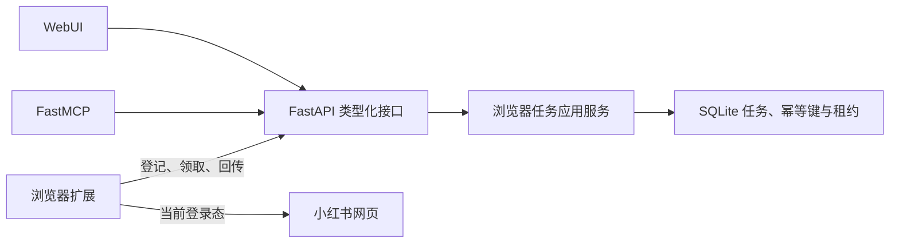

# xiaohongshu-mcp 能力迁移方案

## 目标

将 `xiaohongshu-mcp` 依赖独立浏览器进程完成的浏览、互动能力迁入
`xhs-downloader`，复用现有 FastAPI、WebUI、MCP、SQLite 和浏览器扩展。
迁移能力，不复制原项目的 Go/Rod 实现。

核心边界：

- 小红书登录态和 Cookie 只留在用户浏览器。
- FastAPI 是任务、权限、状态和审计的唯一事实来源。
- MCP 与 WebUI 只调用 FastAPI，不直接调用扩展或数据库。
- 扩展只领取经过服务端验证的任务，并回传封闭的结构化结果。
- 写操作必须可核验；结果不确定时进入 `needs_review`，禁止自动重试。

## 架构



任务状态为：

```text
queued → claimed → running → succeeded | failed | needs_review
```

只读任务租约过期后可回队列；可能产生外部副作用的任务一旦开始执行，
租约过期后必须转为 `needs_review`。

## 能力分组

| 原能力 | 目标入口 | 状态 | 迁移策略 |
| --- | --- | --- | --- |
| 检查登录 | API、MCP、WebUI | 已完成 | 读取页面登录标记，不返回 Cookie |
| 首页推荐 | API、MCP、WebUI | 已完成 | 解析页面状态并验证 Feed Schema |
| 关键词搜索 | API、MCP、WebUI | 已完成 | 读取页面实时搜索结果 |
| 搜索筛选 | API、MCP | 已完成 | 操作筛选面板并读取更新后的页面状态 |
| 帖子详情 | API、MCP、WebUI | 已完成 | 返回正文、媒体、互动数据和已加载评论 |
| 有界评论加载 | API、MCP | 已完成 | 滚动、回复展开、数量上限和停滞检测 |
| 指定用户主页 | API、MCP | 已完成 | 解析资料、统计项和帖子摘要 |
| 当前账号主页 | API、MCP | 已完成 | 通过侧边栏站内导航后解析 |
| 点赞/取消点赞 | API、MCP、WebUI | 已完成 | 目标状态语义，操作后重新读取并核验 |
| 收藏/取消收藏 | API、MCP、WebUI | 已完成 | 目标状态语义，操作后重新读取并核验 |
| 发表评论 | API、MCP、WebUI | 已完成 | 幂等请求、提交后查找新评论并核验 |
| 回复评论 | API、MCP、WebUI | 已完成 | 评论 ID 或用户 ID 定位、有界滚动和提交后核验 |
| 图文/视频发布 | WebUI、扩展 | 已有能力 | 继续使用现有草稿、素材、排期和发布租约 |
| 二维码登录 | 不迁移 | 明确排除 | 直接在真实浏览器页面登录，避免转存凭据 |
| 删除 Cookie | 不迁移 | 明确排除 | 由浏览器站点数据设置负责 |

## 类型化 API

面向 WebUI 和 MCP：

- `POST /xhs/login/status`
- `POST /xhs/feeds/list`
- `POST /xhs/feeds/search`
- `POST /xhs/feeds/detail`
- `POST /xhs/user/profile`
- `POST /xhs/user/me`
- `POST /xhs/feeds/like`
- `POST /xhs/feeds/favorite`
- `POST /xhs/feeds/comment`
- `POST /xhs/feeds/comment/reply`

这些接口接收可选幂等标识，并通过 `wait_seconds` 选择立即返回任务或等待终态。
通用任务查询、重试和扩展执行仍位于 `/browser/*`。

## 数据与安全

- 输入按任务类型使用 Pydantic 模型验证并补全默认值，再计算幂等语义。
- 扩展成功结果必须通过对应结果模型验证，额外字段会被拒绝。
- `xsec_token` 仅作为站内导航输入，不进入日志或用户可见状态说明。
- 公开测试只使用合成 ID、合成文本和保留测试域名。
- 扩展不申请 Cookie 权限；小红书页面权限由内容脚本匹配范围限定。
- 管理接口只允许本机调用；扩展接口要求来源匹配、能力令牌和任务租约。

## 后续实施顺序

1. 使用真实登录浏览器验收选择器、长评论区和页面加载时序。
2. 根据真实页面变化维护合成契约夹具，不提交真实内容或凭据。
3. 为扩展增加可观察的选择器兼容性诊断，但不记录用户原文。
4. 评估把现有发布中心映射为 MCP 草稿与提交工具，继续复用发布租约。

## 验收标准

- Python 通过 Ruff、格式检查和 Pytest。
- WebUI 通过 lint、测试、生产构建及宽窄屏核心交互验收。
- 扩展通过 TypeScript、测试、生产构建和清洁配置文件安装验收。
- 任务重启后可恢复，重复请求不会产生重复写操作。
- 失败、超时和不确定结果对用户可见，不得以空结果伪装成功。
