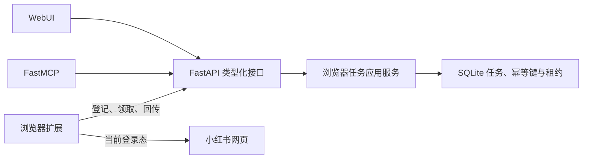

# xiaohongshu-mcp 能力迁移方案

## 目标

将 `xiaohongshu-mcp` 依赖独立浏览器进程完成的浏览、互动和发布能力迁入
`xhs-downloader`，复用现有 FastAPI、WebUI、MCP、SQLite 和浏览器扩展。
迁移能力，不复制原项目的 Go/Rod 实现。

核心边界：

- 浏览器登录态只留在用户浏览器；HTTP Cookie 只留在本机服务配置。
- FastAPI 是任务、权限、状态和审计的唯一事实来源。
- MCP 与 WebUI 只调用 FastAPI，不直接调用扩展或数据库。
- 扩展只领取经过服务端验证的任务，并回传封闭的结构化结果。
- 写操作必须可核验；结果不确定时进入 `needs_review`，禁止自动重试。

## 架构



任务状态为：

```text
queued → claimed → running → succeeded | failed | needs_review
```

只读任务租约过期后可回队列；可能产生外部副作用的任务一旦开始执行，
租约过期后必须转为 `needs_review`。

发布继续使用独立的草稿与发布任务状态机。草稿在提交时冻结内容指纹和
素材 SHA-256；发布结果不确定时同样进入 `needs_review`，必须先人工标记
“已发布”或“未发布”，不得直接重试。

## 能力分组

| 原能力 | 目标入口 | 状态 | 迁移策略 |
| --- | --- | --- | --- |
| 检查登录 | API、MCP、WebUI | 已完成 | 读取页面登录标记，不返回 Cookie |
| 首页推荐 | API、MCP、WebUI | 已完成 | 解析页面状态并验证 Feed Schema |
| 关键词搜索 | API、MCP、WebUI | 已完成 | 读取页面实时搜索结果 |
| 搜索筛选 | API、MCP | 已完成 | 操作筛选面板并读取更新后的页面状态 |
| 帖子详情 | API、MCP、WebUI | 已完成 | 返回正文、媒体、互动数据和已加载评论 |
| 有界评论加载 | API、MCP | 已完成 | 滚动、回复展开、数量上限和停滞检测 |
| 指定用户主页 | API、MCP | 已完成 | 解析资料、统计项和帖子摘要 |
| 当前账号主页 | API、MCP | 已完成 | 通过侧边栏站内导航后解析 |
| 点赞/取消点赞 | API、MCP、WebUI | 已完成 | 目标状态语义，操作后重新读取并核验 |
| 收藏/取消收藏 | API、MCP、WebUI | 已完成 | 目标状态语义，操作后重新读取并核验 |
| 发表评论 | API、MCP、WebUI | 已完成 | 幂等请求、提交后查找新评论并核验 |
| 回复评论 | API、MCP、WebUI | 已完成 | 评论 ID 或用户 ID 定位、有界滚动和提交后核验 |
| 扩展在线状态 | API、WebUI | 已完成 | 持久化登记与最近认证心跳，按轮询周期判断在线 |
| 操作审计记录 | API、WebUI | 已完成 | 展示脱敏任务状态、尝试次数与人工核对提示 |
| 图文/视频发布 | API、MCP、WebUI、扩展 | 已完成 | 草稿、素材指纹、租约、结果核验和显式确认 |
| 原创声明 | API、MCP、WebUI、扩展 | 已完成 | 只支持图文，设置目标状态后重新读取核验 |
| 可见范围 | API、MCP、WebUI、扩展 | 已完成 | 支持公开、仅自己和仅互关好友 |
| 商品绑定 | API、MCP、WebUI、扩展 | 已完成 | 只选择唯一匹配；歧义、缺失或不可确认时中止 |
| 官方定时发布 | API、MCP、WebUI、扩展 | 已完成 | 与本地排期分离，限制为 1 小时至 14 天 |
| 视频处理状态 | 扩展 | 已完成 | 等待上传和转码结束，识别失败与超时后中止 |
| 页面兼容性诊断 | 扩展、SQLite | 已完成 | 记录适配器版本、页面类型和语义锚点，不记录原文 |
| 失败截图 | 扩展本地 | 已完成 | 隐藏文本与媒体后截图，只保留最近两份且不上传 |
| 长内容与分页元数据 | API、扩展 | 已完成 | 有界截断、结果上限、游标和 `has_more` |
| 二维码登录 | API、MCP、WebUI、扩展 | 已完成 | 从真实登录页一次性交付短期图片，保留标签页完成扫码握手 |
| 删除 Cookie | API、MCP、WebUI、扩展 | 已完成 | 浏览器按站点清理；HTTP 模式清除本机配置并提示重启 |

## 类型化 API

面向 WebUI 和 MCP：

- `POST /xhs/login/status`
- `POST /xhs/login/qrcode`
- `POST /xhs/login/cookies/delete`
- `POST /xhs/feeds/list`
- `POST /xhs/feeds/search`
- `POST /xhs/feeds/detail`
- `POST /xhs/user/profile`
- `POST /xhs/user/me`
- `POST /xhs/feeds/like`
- `POST /xhs/feeds/favorite`
- `POST /xhs/feeds/comment`
- `POST /xhs/feeds/comment/reply`

发布管理：

- `POST /publication/drafts`
- `PUT /publication/drafts/{draft_id}`
- `POST /publication/drafts/{draft_id}/assets`
- `POST /publication/drafts/{draft_id}/submit`
- `POST /publication/tasks/{task_id}/review`
- `POST /publication/tasks/{task_id}/retry`

`submit` 的模式含义：

- `manual`：立即打开创作页并发布。
- `scheduled`：本机到期后才由扩展执行，届时本机服务和浏览器必须在线。
- `platform_scheduled`：现在由扩展填写创作页，把时间交给小红书官方排期。

这些接口接收可选幂等标识，并通过 `wait_seconds` 选择立即返回任务或等待终态。
通用任务查询、重试和扩展执行仍位于 `/browser/*`；本机管理界面通过
`GET /browser/extensions` 读取扩展登记和最近心跳。

## 数据与安全

- 输入按任务类型使用 Pydantic 模型验证并补全默认值，再计算幂等语义。
- 扩展成功结果必须通过对应结果模型验证，额外字段会被拒绝。
- `xsec_token` 仅作为站内导航输入，不进入日志或用户可见状态说明。
- 公开测试只使用合成 ID、合成文本和保留测试域名。
- 扩展不申请 Cookie 权限；小红书页面权限由内容脚本匹配范围限定。
- 扩展使用 `browsingData` 只清理小红书来源的 Cookie，不能读取 Cookie 内容。
- 二维码只接受受限图片 Data URL；API 响应后立即擦除持久化任务中的图片，
  MCP 以图片内容块交付，结构化结果不保留 Base64。
- 心跳只保存扩展标识和认证时间，不包含浏览历史、账号信息或页面内容。
- 管理接口只允许本机调用；扩展接口要求来源匹配、能力令牌和任务租约。
- MCP 发布只接受用户明确提供的普通文件绝对路径，素材仍由 FastAPI 校验。
- `publish_content` 和 `publish_video` 必须传入 `confirmed=true`；工具声明为
  非幂等的外部写操作，MCP 客户端不能绕过确认。
- 发布商品会在最终确认区逐项展示；扩展不会自动选择“第一个结果”。
- 失败诊断只包含固定语义锚点；脱敏截图仅存在扩展本地存储，不上传 API。

## 实施批次

1. P0：通用任务、扩展租约、登录、推荐、搜索、详情、评论和主页。
2. P1：点赞、收藏、评论、回复、目标状态核验、审计与人工确认。
3. P2：发布选项、视频处理、官方定时、MCP 发布和 WebUI 二次确认。
4. P3：协议版本、选择器兼容诊断、脱敏失败证据、断线恢复和结果上限。
5. P4：二维码登录、一次性交付和浏览器/HTTP 双会话清理。

真实页面变化不属于可静态锁定的完成项。后续维护以脱敏诊断中的适配器版本、
页面类型和缺失锚点为依据更新合成契约夹具；不得提交真实帖子、Cookie、
截图或用户原文。

Cookie + HTTP、浏览器扩展、受管浏览器和自动路由的后续讨论见
[普通用户自动化访问模式设计讨论](automation-access-modes.md)。

## 验收标准

- Python 通过 Ruff、格式检查和 Pytest。
- WebUI 通过 lint、测试、生产构建及宽窄屏核心交互验收。
- 扩展通过 TypeScript、测试、生产构建和清洁配置文件安装验收。
- 任务重启后可恢复，重复请求不会产生重复写操作。
- 失败、超时和不确定结果对用户可见，不得以空结果伪装成功。
- 发布、评论和回复必须覆盖成功、明确失败与结果不确定三条状态路径。
- WebUI 的立即发布、本地定时、官方定时和人工核对均需二次确认。
